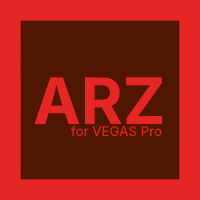
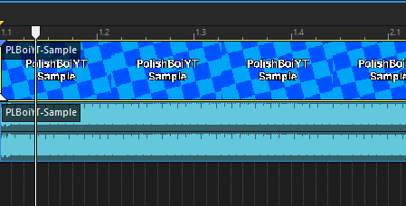
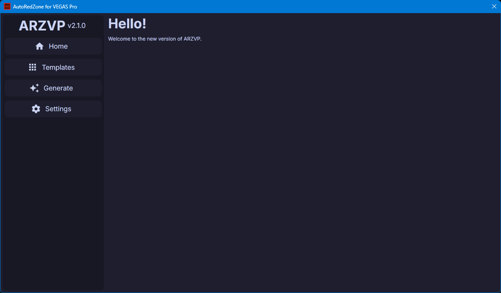
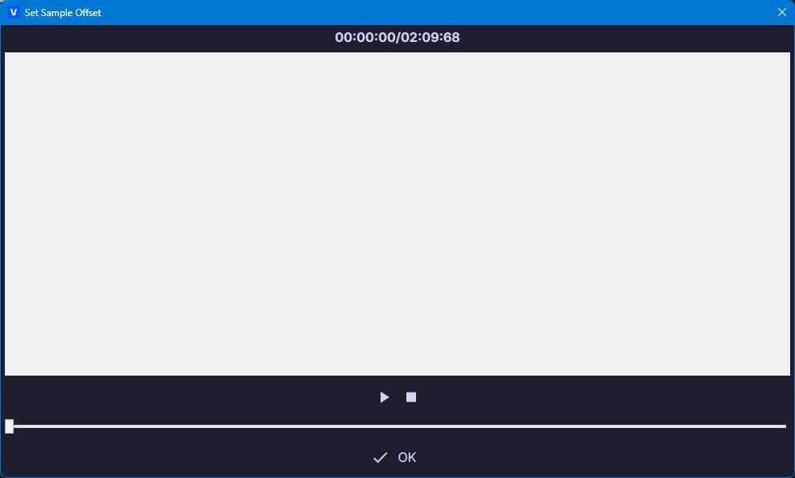
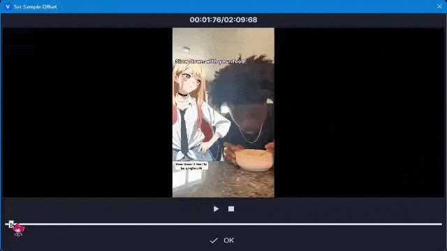

	
	<h1>AutoRedZone for VEGAS Pro</h1>

## What is this?
**AutoRedZone for VEGAS Pro** (also known as ARZVP) is an attempt of recreating [AutoRedZone](https://molokheiya.stars.ne.jp/KDC/ARZv2Series/)'s functionality in VEGAS Pro.

## Before installing
You need FFmpeg installed and added to your PATH:
1. Download and extract https://github.com/ffbinaries/ffbinaries-prebuilt/releases/download/v6.1/ffmpeg-6.1-win-64.zip to wherever you want
2. Open the start menu, type "environment variables" and click "Edit the system environment variables"
3. Click on "Environment Variables...", then double click on "Path", then click "New"
4. Enter the path of the ffmpeg.exe file you extracted.
5. Click OK and restart VEGAS Pro

You will also need VLC media player (for the video scrubber to work properly), you can download the installer from [here](https://www.videolan.org/vlc/).

## How do I get it?
Go to the [releases](https://github.com/Demiomad/ARZVP/releases/latest) page and download the `ARZVPv2-setup.exe` file.

Once the file has been downloaded, open it.
The installer will automatically set up the required language files, templates, and add the script to VEGAS Pro's Script Menu folder.

## Quick Start
- Download and install the latest version.
- Open VEGAS Pro, add a new video to your timeline and make sure that the **video** event is selected:

**It should be highlighted with a yellow border.**

- Go to `Tools -> Scripting -> AutoRedZone for VEGAS Pro -> ARZVPRewrite`
- You should see this window:

- Go to `Templates` and select a template.
- Afterwards, go to the `Generate` tab and click `Generate`
- You should see this window:

- You will need to press the play button once (so the video preview isn't a white box)
- After the video loads, you can use the slider to "scrub" through the video.

- Once you're happy, click OK and the template should generate.

## I have an issue.
Please report it in the [Discord server](https://discord.gg/XkwHBfYqPY) (in the #❓║help channel) or in [GitHub Issues](https://github.com/Demiomad/ARZVP/issues)